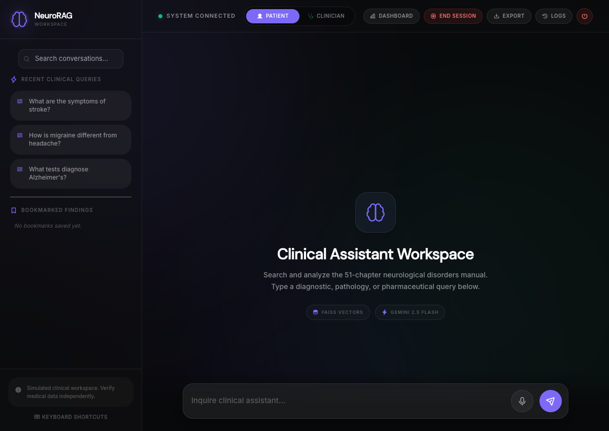
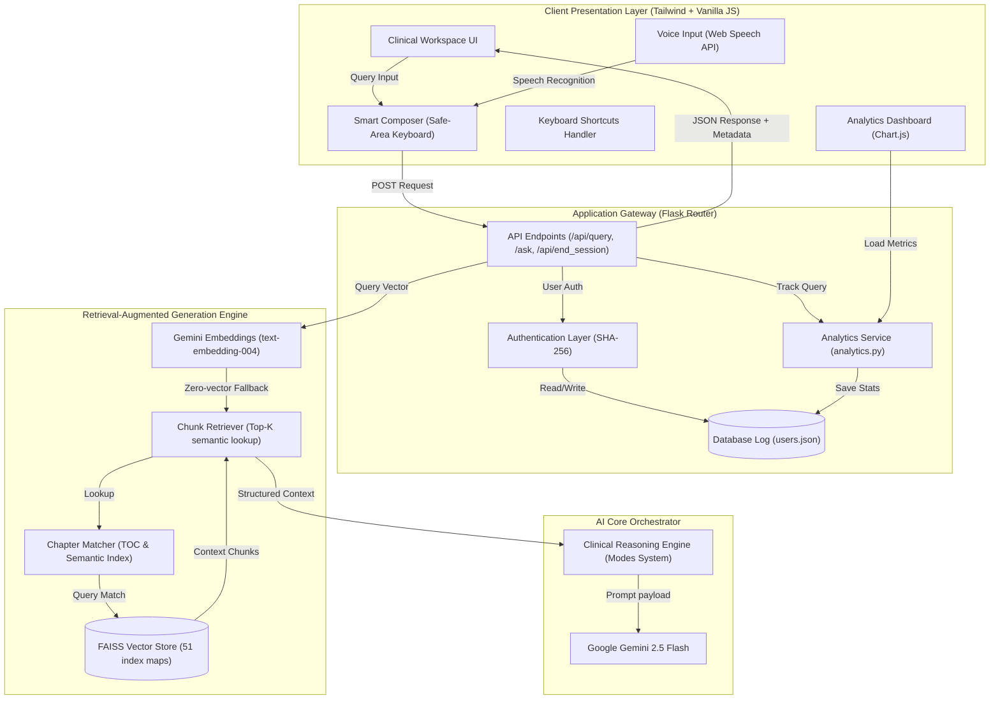
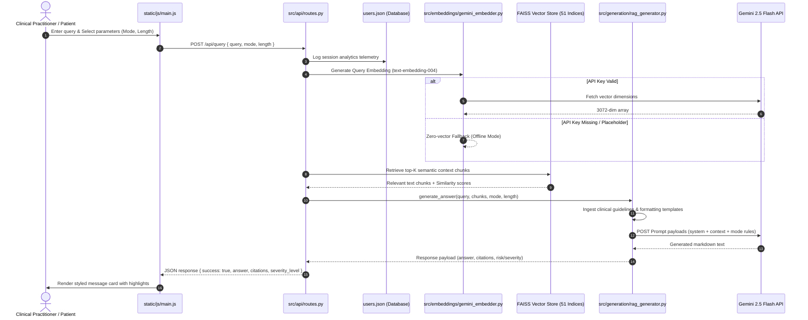
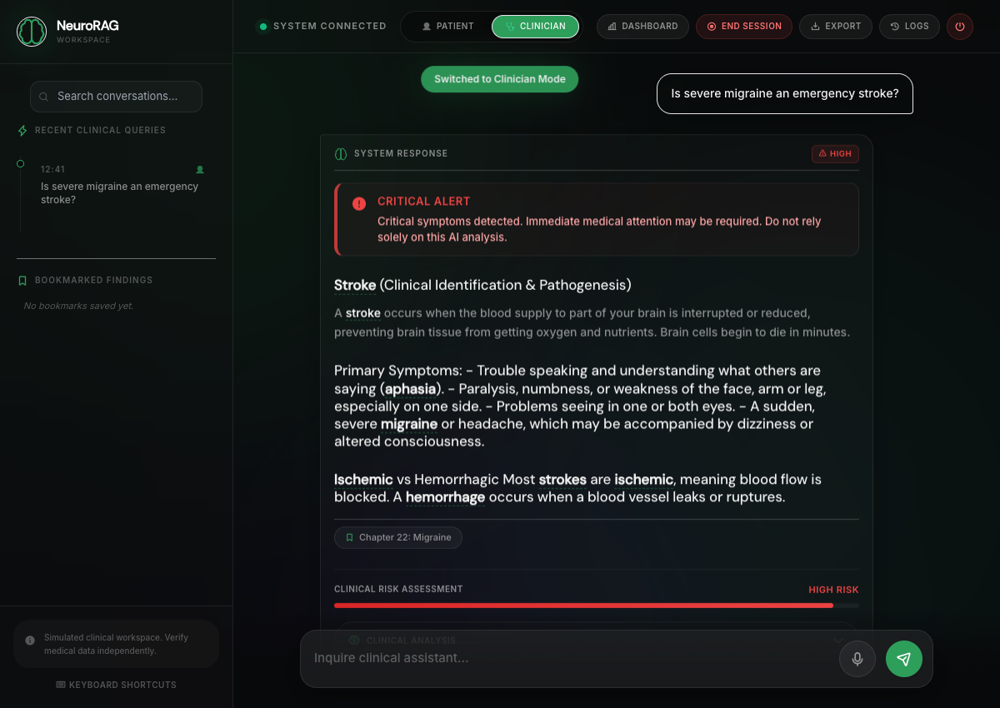
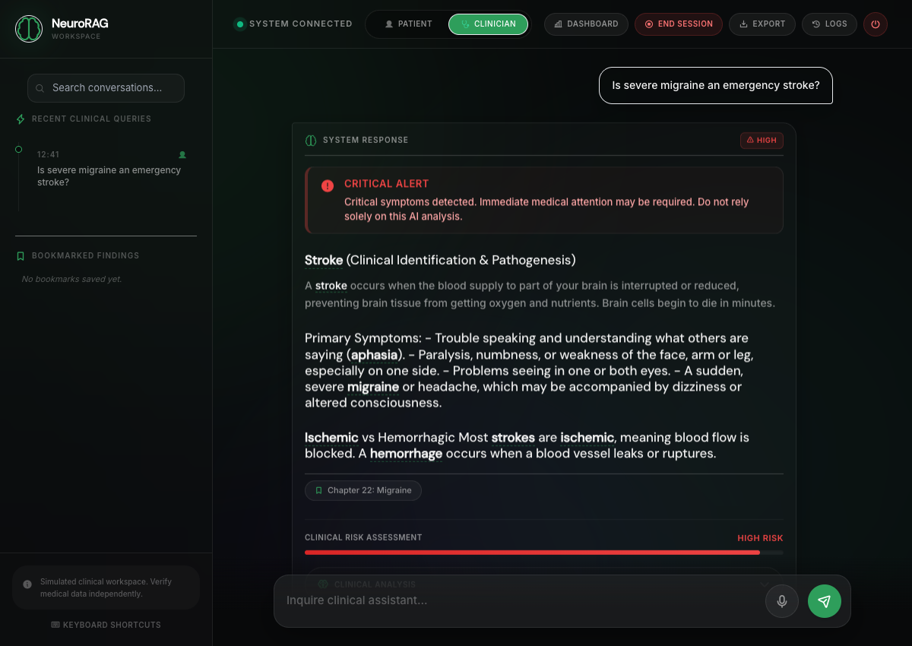
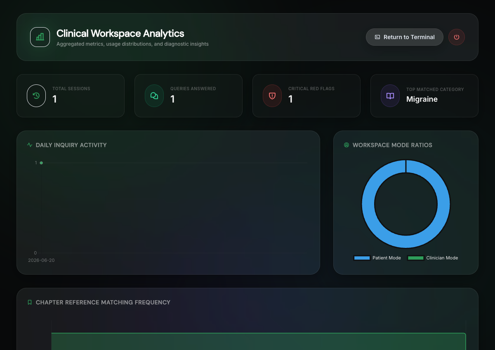

# <div align="center">🧠 NeuroRAG</div>
### <div align="center">Advanced Clinical AI Workstation · Powered by Gemini + Retrieval-Augmented Generation</div>

<div align="center">
  <a href="https://github.com/Sumanthss888/NeuroRAG"></a>
  
  
  
  
</div>

<br/>

<div align="center">
  
</div>

---

## 🧭 Quick Navigation

- [🏥 Why NeuroRAG?](#-why-neurorag)
- [🏗️ System Architecture](#️-system-architecture)
- [🎨 Feature Showcase](#-feature-showcase)
- [👥 Dual-Mode Interface](#-dual-mode-interface)
- [📑 Source Citation & monospaced Chapter Viewer](#-source-citation--monospaced-chapter-viewer)
- [📊 Clinician Usage Dashboard](#-clinician-usage-dashboard)
- [🚨 Red-Flag alerts & Severity Badges](#-red-flag-alerts--severity-badges)
- [🔖 Bookmarks & Session summaries](#-bookmarks-session-summaries)
- [🎙️ Web Voice Input & Shortcuts](#️-web-voice-input--shortcuts)
- [🛠️ Technology Stack](#️-technology-stack)
- [📂 Project Structure](#-project-structure)
- [🚀 Setup & Launch](#-setup--launch)
- [🗺️ Product Roadmap](#️-product-roadmap)
- [👤 Contributors & Authors](#-contributors--authors)
- [⚠️ Medical Disclaimer](#️-medical-disclaimer)

---

## 🏥 Why NeuroRAG?

NeuroRAG is a premium clinical workstation designed for medical professionals and patients to query the comprehensive **51-chapter neurological disorders manual**. It replaces hallucination-prone generic chatbots with evidence-grounded, mode-sensitive neurological intelligence.

| Feature | Generic Chatbots | NeuroRAG |
| :--- | :---: | :---: |
| **Evidence Grounding** | ❌ Hallucinates clinical dosages | 🎯 Context-anchored clinical manual facts |
| **Source Transparency** | ❌ Opaque references | 📚 Real-time chapter similarity citations |
| **Clinical Analysis** | ❌ Surface level answers | 🧠 Risk assessment snapshots & diagnostic reasons |
| **Dual-Mode Logic** | ❌ Single tone answers | 👥 Clinician vs Patient tailored terminology |
| **Emergencies Handling** | ❌ Muted warnings | 🚨 Automatic red-flag critical alerts |
| **Session Control** | ❌ Infinite scrolls | ⏱️ Session Summarization & Logs Archival |

---

## 🏗️ System Architecture

NeuroRAG is built as a modular clinical RAG engine. Below is a blueprint of the workspace flow:



### 🔄 Clinical Query & Retrieval Sequence



---

## 🎨 Feature Showcase

### 👥 Dual-Mode Interface
Tailor clinical communication instantly with the dual-mode logic controller (`src/generation/mode_transformer.py`):
- **Clinician Mode (Professional Assessment):** Focuses on technical pathophysiological descriptions, precise anatomical structures, and diagnostic workflows. Leverages specialized medical nomenclature.
- **Patient Mode (Empathetic Translation):** Automatically translates complex terms into layperson-friendly language, introduces analogies for complex physiological processes, and appends reassuring safety guidelines.

<div align="center">
  
</div>

### 📏 Adaptive Response Length Controller
Configure the granularity of synthesized outputs dynamically via the query composer controls:
- **Concise (⚡ Summary):** Delivers direct, action-oriented findings within a target of **80–120 words**. Removes secondary explanations and structures text with very light formatting for rapid reference.
- **Standard (⚖️ Balanced):** Provides standard structured clinical assessments including numbered guides, bullet highlights, and standard citation tracking (**200–350 words**).
- **Detailed (📚 In-Depth):** Generates full textbook-grade reviews detailing pathophysiology, differential diagnosis tables, step-by-step treatment pathways, and thorough prognosis summaries (**500–800 words**).

### 📑 Source Citation & monospaced Chapter Viewer
- Interactive source citations displayed beneath responses.
- Click a citation to overlay a detailed **Source Viewer Modal** containing page numbers, cosine similarity scores, and raw monospaced hand-book retrieved text.
<div align="center">
  
</div>

### 📊 Clinician Usage Dashboard
- High-performance dashboard featuring Chart.js integrations.
- Tracks monthly query volumes, patient/clinician mode splits, and chapter lookup distributions.
<div align="center">
  
</div>

### 🚨 Red-Flag alerts & Severity Badges
- Real-time keyword scanning automatically triggers prominent red alerts for critical emergencies.
- AI responses include color-coded severity badges (`informational` 🟢, `medium` 🟡, or `high` 🔴 with pulsing glow borders) indicating diagnostic urgency.

### 🔖 Bookmarks & Session summaries
- Save specific AI responses to `localStorage` (secured per-user profile).
- Sidebar bookmark drawer allows scrolling back or restoring old query states instantly.
- Click **End Session** to trigger an AI summary generation of your workspace queries, archiving session stats in collapsible timeline logs.

### 🎙️ Web Voice Input & Shortcuts
- Talk directly to the composer using Web Speech recognition with visual pulse state feedback.
- Drive the application using core keyboard shortcuts (`⌘/Ctrl + K` to search logs, `⌘/Ctrl + Enter` to submit query, `⌘/Ctrl + B` to toggle sidebar panel, `Escape` to close modals, and `?` for help).

---

## 🛠️ Technology Stack

| Component | Framework / Library | Purpose |
| :--- | :--- | :--- |
| **Frontend** | Vanilla JavaScript (ES6+), Tailwind CSS | Fast, elegant glassmorphic layouts |
| **Icons & Charts**| Phosphor Icons, Chart.js | Ambient clinical visuals and telemetry |
| **Backend** | Flask (Python 3.10+), Flask-CORS | Secure REST routing & session auth |
| **Vector DB** | FAISS (Facebook AI Similarity Search) | High-performance semantic vector lookup |
| **AI LLM** | Google GenAI SDK (Gemini 2.5 Flash) | Response synthesis, suggested questions & summaries |
| **Embeddings** | Gemini text-embedding-004 | Context semantic mappings (3072 dimensions) |

---

## 📂 Project Structure

```text
├── app.py                      # Main Flask application entry & session persistence
├── preprocess.py               # Document extractor & embedding parser pipeline
├── requirements.txt            # Project dependencies
├── users.json                  # Encrypted credentials & sessions database (gitignored in production)
├── src/
│   ├── api/
│   │   └── routes.py           # Core route controllers (/api/query, /ask, /api/end_session)
│   ├── embeddings/
│   │   └── gemini_embedder.py  # Gemini vector embeddings mapper with zero-vector fallback
│   ├── generation/
│   │   ├── rag_generator.py    # Answer synthesis & AI summarizer
│   │   └── mode_transformer.py # Clinician/Patient mode style rules
│   ├── retrieval/
│   │   ├── chapter_matcher.py  # Title/chapter boundary indices
│   │   └── chunk_retriever.py  # Semantic vector chunk compiler
│   └── utils/
│       ├── analytics.py        # Chart.js metrics aggregator service
│       └── config.py           # Centralized environment parameters
├── static/
│   ├── css/
│   │   └── style.css           # Custom CSS, skeletons, glass layout overlays & scrollbars
│   └── js/
│       └── main.js             # Client state manager, hotkey handlers & toast system
└── templates/
    ├── index.html              # Clinical workspace entry layout
    ├── dashboard.html          # Analytics telemetry grid
    └── chat_history.html       # Archive log explorer
```

---

## 🚀 Setup & Launch

### 1. Prerequisites
- Python 3.10+
- Google Gemini API Key

### 2. Quick-Start (Mac/Linux)
We provide an automated setup helper:
```bash
chmod +x setup.sh
./setup.sh
```

### 3. Manual Configuration
```bash
# 1. Clone & enter repository
git clone https://github.com/Sumanthss888/NeuroRAG.git
cd NeuroRAG

# 2. Setup virtual environment
python3 -m venv venv
source venv/bin/activate

# 3. Install packages
pip install -r requirements.txt

# 4. Save API credentials
echo "GEMINI_API_KEY=your_gemini_api_key_here" > .env
```

### 4. Setup Chunks Database
Place your neurology handbook PDF in:
`data/raw/neurology_handbook.pdf`

Run the vector construction pipeline:
```bash
python preprocess.py
```

### 5. Launch
```bash
python app.py
```
Open **`http://localhost:5000`** in your browser.

---

## 🗺️ Product Roadmap

### v1.0 — Core Search
- Chapter semantic search indexing using FAISS
- Basic query completion via Gemini API

### v2.0 — Premium Workspace
- Glassmorphic desktop layout
- Clinician vs Patient dual modes
- Chapter citations audit trail

### v3.0 — Productivity & Power Features
- Smart text search, keyboard shortcuts & voice inputs
- Session summaries logs & persistent local bookmarks
- Usage telemetry dashboard

### Future Releases
- **Multi-Document Support:** Query multiple clinical textbooks simultaneously
- **Semantic Memory:** Graph DB linking symptoms, treatments, and drug interactions
- **Confidence Scoring:** Color-coded text highlighting based on retrieval match margins

---

## 👤 Contributors & Authors
- **Sumanth** - [GitHub Profile](https://github.com/Sumanthss888) · [LinkedIn](https://linkedin.com)

---

## ⚠️ Medical Disclaimer
> [!CAUTION]
> **Educational & Supplementary Resource Only:** NeuroRAG is an AI assistant trained on static medical literature. It does **not** provide clinical diagnosis or patient medical advice. All dosage schedules, diagnostic assessments, and warnings should be verified independently by a licensed medical professional before patient administration.
